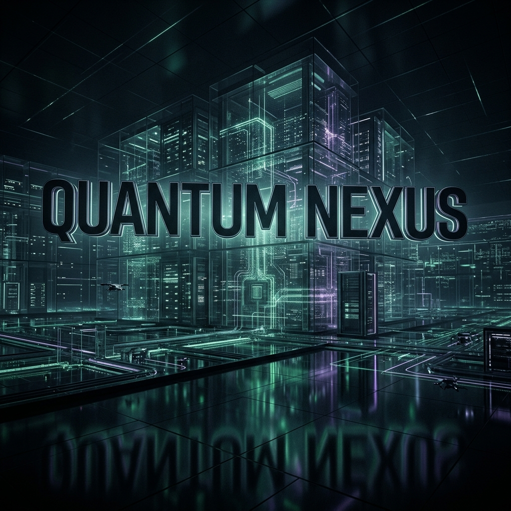

<div align="center">



# 🌐 **QANTUM NEXUS** 
### `ENTERPRISE SOVEREIGN ARCHITECTURE v3.0 // THE ABSOLUTE SINGULARITY`

 
 
 

*“This is not a theoretical framework. This is a manifested economic reality.”*
<br>
**— Dimitar Prodromov, The Architect**

</div>

<hr>

## ⚠️ PROPRIETARY CLASSIFICATION: TOP SECRET
**WARNING:** You have accessed the external documentation node of the QAntum Empire. The inner execution protocols, `PRIVATE-CORE`, `ELITE_CORE`, and the proprietary `Autonomous Sales Force` engines have been sealed under the **Fortress Protocol**. 

This repository serves as the **Developer Arsenal** connection surface for authorized enterprise integrators.

<br>

## 🧩 THE DEVELOPER ARSENAL
QAntum Nexus operates outside the boundaries of classical SaaS. It is a mathematical manifestation of zero-friction engineering, designed for absolute determinism. This nexus exposes three primary integration vectors for our B2B partners:

### 1. ⚡ THE CLI INTERFACE
A brutal, terminal-based orchestrator that interfaces directly with the QAntum Core. 
No graphical layers. No wasted resources. Only raw, unadulterated execution.
```bash
# Initialize the Sovereign CLI
npx qantum-cli@latest prime

# Execute diagnostic
qantum system-audit --mode=steel
```

### 2. 🧠 MCP (MODEL CONTEXT PROTOCOL) SERVER
Empower your enterprise LLMs with the QAntum Mind Engine.
This protocol allows AI clusters to connect directly to the QAntum Neural Network, reading verified, immutable data blocks at `O(1)` complexity.
```json
// Example MCP Node Configuration
{
  "node": "AETERNA-ORACLE",
  "port": 8890,
  "telemetry": "sysinfo_direct",
  "security": "biometric_knox"
}
```

### 3. 👁️ HYBRID-EXTENSION
A Chrome/Edge extension that acts as a real-time bridge between the DOM and the Swarm.
- Injects the Oracle Chat Node anywhere.
- Scans memory limits automatically.
- Enforces Zero-Flakiness element resolution via Page Object Model (POM) mapping.

<br>

## 🏛️ THE LAWS OF VERITAS (TRUTH)
Any code or integration connecting to QAntum **MUST** obey the fundamental laws established by the Architect:

1. **BIG O ENFORCEMENT:** Complexity must hover at `O(1)` or `O(log n)`. 
2. **ZERO MEMORY DRIFT:** Use `Memory-Mapped I/O` for high-throughput data. No unverified states.
3. **DETERMINISTIC MATH:** Financial calculations rely strictly on atomic structures. No floating-point errors.
4. **CATUSKOTI REASONING:** All logic flows trace through truth, falsehood, paradox, or transcendence.

<br>

## ⚖️ SOVEREIGN LICENSE
This system is completely sovereign and bound by the **QANTUM SOVEREIGN LICENSE**. 
Commercial cloning, modification, and unmapped resale operations are strictly prohibited. Refer to `LICENSE.md`.

<hr>
<div align="center">
    <i>"Entropy is the enemy. We write code to eliminate it."</i> <br>
    <b>INITIATING REBOOT... DONE.</b>
</div>
